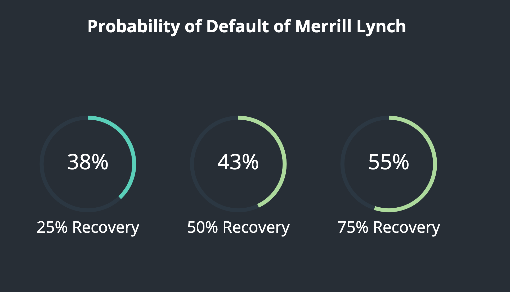
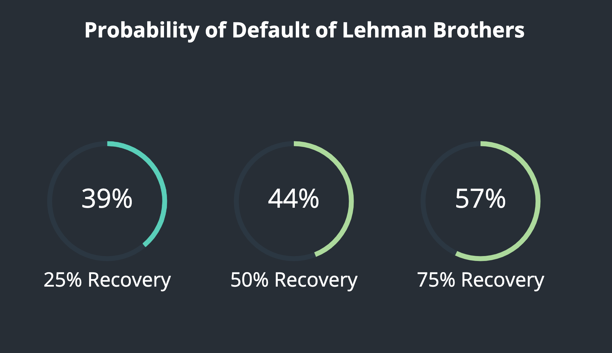
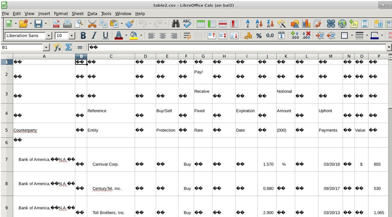
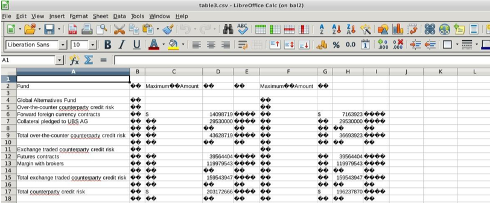

# Credit Default Swap Search Engine

## Introduction

Credit Default Swap Search Engine is an efficient search engine based on RESTful APIs to allow you to search and navigate historical mentions of credit default swaps all the way from 2004 - 2017. One can simply search for any specific credit default swap that they are looking for by simply entering the name of the *counterparty* or the *reference entity*.

## Features

The search engine has quite a few other resources which have been described in detail below:

### Search Engine

Upon extracting information from both structured and unstructured formats of Credit Default Swap reportings, we developed a search engine to enable future research studies to further take advantage of the consolidated data that has been aggregated through rule-based as well as NLP techniques.
 
 
This web application was built on Flask with the entire dataset of 16,813 rows into an array of JSON objects. JSON objects are the defacto standard for query based searching and also allow swift query and return time. Furthermore, this web application also serves as a way for researchers and financial analysts to upload reports that they want the Credit Default Swap information extracted from. The application itself is capable of extracting both structured as well as unstructured reporting of CDS as the model is running at the backend and is served as a RESTful framework.

*Insert screenshot here*
### Named Entity Recognition

This part of the web application wants to show the trained Conditional Random Field model in action and gives an interactive way to do so. Once has to simply, enter the unstructured credit default swap sentence that he wants to be extracted and the API running in the backend will highlight the entities. A snapshot of the UI has been given below:

*Insert screenshot here*

### Report Processing

Report Processing enables analysts and researches to extract all the Credit Default Swap mentions any report by simply uploading the report they wish to be extracted(in .NET format) and shows all the CDS mentions in a structured format which could be easily downloaded for various studies and analysis.

*insert screenshot here*
### Probability of Default

Predicting the financial health of a company is something that financial analysts have longed for a very long time. In specific to the CDS market, this sort of analysis has a lot of relevance in the practical real world where in financial crisis could be evaded if such a framework devised in this research paper could be implemented and the data so extracted could be studied.  
 
To help serve as an example for future research and analysis, we have developed a novel method using one of a kind Credit Default Swap dataeet that we have developed. In order to predict the probability of default of Credit Default Swap, there are some key factors which play a role. These include, the recovery rate R and credit spread S. The dataset that we have put together allows us to extract the credit spread S for all the credit default swaps reported from 2004-2017 and hence allows us to compute the default probability of the firms that the user wants to search for by simply typing their name. What simplifies the entire process is the RESTful API which is running in the backend computing the default probabilities for all the three possible recovery rates and allowing the user to understand the likelihood of a specific financial institution defaulting on their credit default swap portfolio.  
 
Applications like this show how useful a Credit Default Swap dataset would be to trade in the CDS market and also shows the power of computation by using existing quantitative finance formula.
 
 

 
 

## Basic Folder Structure

1. Data folder contains all the extracted .csv files from the reports extracted from the SEC website to be used for searching purpose.
2. Images folder contains the images used in the readme.
3. Notebooks folder contains the python notebooks used to generate Credit Default Swap Dataset specifically the *Unified CSV Generation* notebook.
4. The Searchapp folder contains the web application developed to power the Credit Default Swap Search Engine and the installation and demo instructions have been given below
5. Dataset contains the Credit Default Swap dataset
6. UnifiedCSVTestData folder contains raw tables extracted befure unification for powering the searching for individual reports containing individual tables also called as *raw tables* view in the Credit Default Swap Search Engine app.
7. Finally, Uploads folder contains variety of scripts used for small ad-hoc tasks and is combined together using a master script to power the *report processing* view on the web app. The description of some of the scripts has been provided below:
   1. checkTable.sh --> a bash script to run this on all the reports in the three folders. The folders from which we could extract tables were put into a separate structured folder and the rest of the files were put in an unstructured folder. This resulted in there being 3 structured folders each containing the tables from each report.
   2. Format.py --> Once we had the all the useful tables in different folders, we started working on formatting the tables. We found after going through the data that most of the     tables had a different format for the data. This meant that we had to go through the csv files manually, try and identify a pattern which was followed by the majority of the tables and then try and write a python script to format those kinds of scripts.

    **Figure 1** 

    Above figures show an example of the types of format that the tables initially have. The other files may have a completely different format. We identified in majority of the files, there were a lot of random characters and spaces present in the cells in the csv files between the cells which actually had the information. We wrote a python script to eliminate all of these random characters and shift the cells with the actual information.

     
     

    **Figure 2** 
     
     
    The script works by taking in the unformatted file as the first argument and another filename which will contain the formatted table as the second argument. We loop over each row in the csv file and initialize an array which will contain values for the formatted row. We then go through each cell in the row and check if the character matches any of the random unwanted characters or spaces and if it does, we just ignore it. We initialize a counter i to 0 in the beginning of the loop and this gives us the index of the value and just increment it by 1, after checking if doing this won‘t exceed the length of the row, to ignore the unwanted characters. If the cell has useful information, we append it to the new empty array which we initialized and then incre- ment the value of i. The unwanted characters which we are checking have all been hardcoded after going manually through all the reports as it would have otherwise been impossible to identify all the different types of these characters.
     
     
    After it goes through all the rows, we have another check in place to see if the length of the row after removing all the unwanted character exceeds 3 and only if this condition is true, we write it to the new file. This check is in place to help us eliminate those rows and csv files which dont actually have any useful CDS values that we require. An example of this is shown in the image below.
     
     
     **Figure 3**
     
     
    We see that this table came to be part of the current data set as it has the word counterparty in it and hence, it passed the first shell script. It however, doesnt contain any useful information that we require, and as it would have only 3 columns after formatting, with the final if condition, none of the rows would get written to the output file and hence it would only give a blank csv file as the output.

## Installation

## Requirements

<ul>
    <li>Python 3.7.3 64-bit</li>
    <li>Flask==1.0.2</li>
    <li>Jinja2==2.10</li>
    <li>json2html==1.2.1</li>
    <li>pandas==0.24.2</li>
</ul>

_More updates will follow with time_
